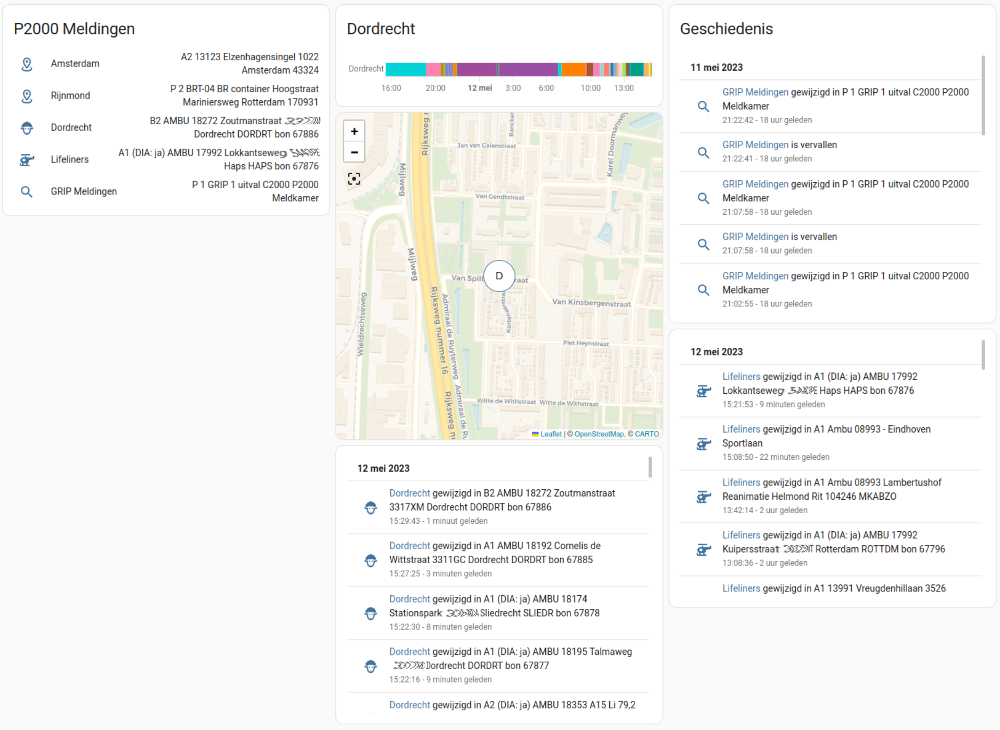
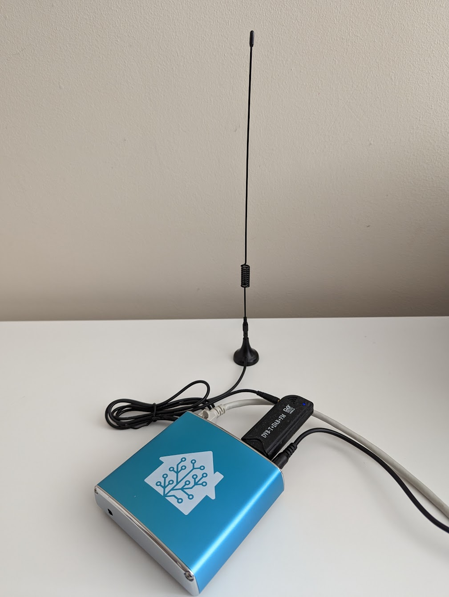

# Home Assistant Add-on: P2000 RTL-SDR

_Receive P2000 events using Home Assistant and your RTL-SDR dongle._

![Supports aarch64 Architecture][aarch64-shield]
![Supports amd64 Architecture][amd64-shield]
![Supports armhf Architecture][armhf-shield]
![Supports armv7 Architecture][armv7-shield]
![Supports i386 Architecture][i386-shield]

[aarch64-shield]: https://img.shields.io/badge/aarch64-yes-green.svg
[amd64-shield]: https://img.shields.io/badge/amd64-yes-green.svg
[armhf-shield]: https://img.shields.io/badge/armhf-yes-green.svg
[armv7-shield]: https://img.shields.io/badge/armv7-yes-green.svg
[i386-shield]: https://img.shields.io/badge/i386-yes-green.svg

## About

An all-in-one add-on for receiving P2000 events from the air, filter them as you like and update sensors with detailed information.

## Features

This add-on is based on my standalone project called 'RTL-SDR-P2000Receiver-HA' which had been created to run on a seperate Linux device,  it was rewritten as an Hassio add-on, I left out unneeded code, added MQTT autoconfigure and optimized it.

It comes out of the box with the following features:

 - Standalone P2000 messages receiver using a local RTL-SDR compatible receiver
 - Support for a large number of RTL-SDR dongles models
 - Automatic MQTT sender configuration and device discovery/creation
 - Global text and capcode filter options
 - Unlimited number of sensors and filters (as long as hardware resources can handle it)
 - Includes detailed capcode and city names database created from data on https://www.tomzulu10capcodes.nl and http://p2000.bommel.net
 - Code to guess and complete as much address data as possible
 - Geocode functionality using https://opencagedata.com to get rough lat/long location and maps links, fetched data is stored for future use.

## Installation
The installation of this add-on is pretty straightforward and not different in comparison to installing any other add-on.

1. Add my add-ons repository to your home assistant instance  
   (in supervisor addons store at top right, or click button below if you have configured my HA)  
   
1. Install this add-on.
1. Click the `Save` button to store your configuration.
1. Set the add-on options to your preferences (see documentation tab after installation)
1. Start the add-on.
1. Check the logs of the add-on to see if everything went well.

Make sure your RTL-SDR dongle is inserted in the Home assistant device.  
Place your antenna in a good location near the window, or even outside.

If you don't see the wanted result, consider setting verbosity to 'debug' and restart.  
Don't leave verbosity debug enabled for a long time, since it logs a lot of data, and can wear out your storage devices.

